# Instalación de Maven en el SO

## 1.- Instalar Apache Maven

Primero actualizamos los repositorios de Ubuntu:

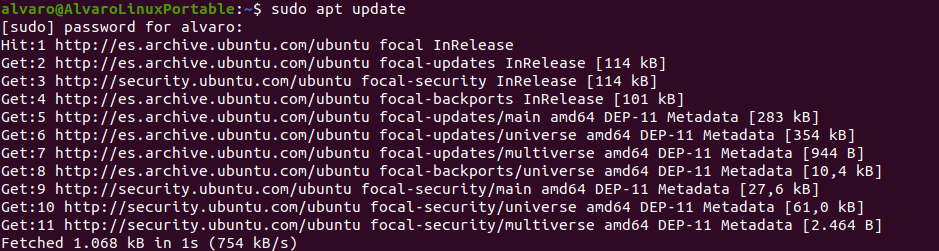

Instalamos Maven:

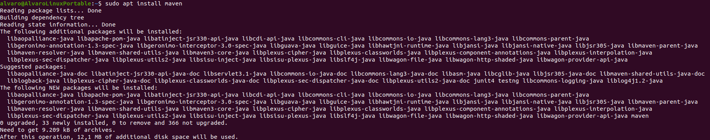

Verificamos la versión instalada:

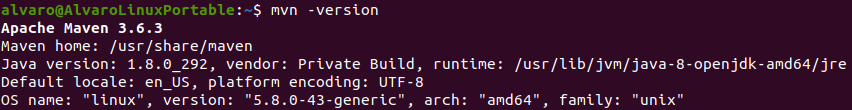

Vemos que se descarga la versión 3.6.3, pero la última versión es la 3.8.2 por lo que necesitamos instalar la versión concreta de Maven.

## 2.- Instalar una versión concreta de Apache Maven

Descargamos la versión 3.8.2 en el directorio /tmp:

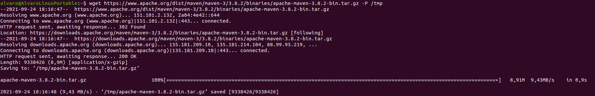

Una vez completada la descarga, extraemos los archivos en el directorio /opt:

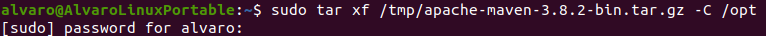

Ahora creamos un enlace simbólico que apunte al directorio de instalación de maven para tener más control sobre este:

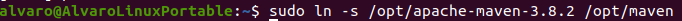

### 2.1.- Establecer variables de entorno

Creamos el archivo maven.sh en el directorio “/etc/profile.d” y lo abrimos con el editor nano:

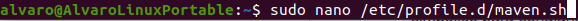

Añadimos el siguiente código:

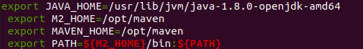

Guardamos el archivo y le damos permisos de ejecució:

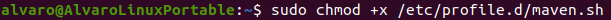

Finalmente, cargamos las variables de entorno usando el comando source.

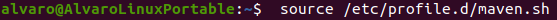

### 2.2.- Verificar la instalación

Ejecutamos el comando “mvn -version” y vemos que ahora sí aparece la versión actual de Apache Maven.

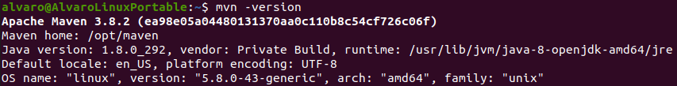
